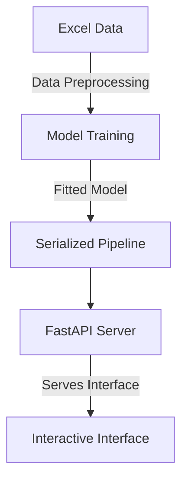

# Concrete Strength Prediction Project

Welcome. This document outlines the architecture of a machine learning application designed to predict the strength of concrete prior to physical mixing.

The system ingests raw tabular data, trains a predictive pipeline to identify complex patterns, and serves a frontend application for rapid strength estimations based on mixture proportions.

## 1. Project Architecture Overview

Here is the flow of information throughout the application:

## 2. Model Training and Evaluation

The initial phase involves training the predictive model to correlate mixture proportions, such as cement and water, with the final compressive strength.

> [!NOTE]
> **Data Preprocessing Phase**  
> Robust models require pristine datasets. The preprocessing pipeline automatically imputes missing values and removes non predictive metadata, ensuring optimal data quality.

Multiple regression algorithms were evaluated to determine the optimal predictive approach.

> [!IMPORTANT]
> **Optimal Algorithm: Gradient Boosting**  
> The evaluation identified Gradient Boosting as the superior algorithm. During testing on unseen data, it achieved a 98.06 percent variance explanation metric. 
> 
> Furthermore, the mean absolute error is 1.29 units from the actual strength. This demonstrates high reliability for practical applications.

**Feature Importance Analysis**
The algorithm determined that the ultimate load and the cement volume are the primary predictive factors for determining overall structural integrity.

## 3. Deployment via REST API

An accessible deployment strategy is necessary for user interaction. To facilitate seamless interaction with the model, we deployed a high performance **FastAPI REST Server**. This acts as the bridge between the user interface and the underlying machine learning logic:

1. **Request:** The web client sends the concrete ingredient parameters via a JSON payload.
2. **Processing:** FastAPI routes this payload directly to our preloaded Machine Learning pipeline.
3. **Inference:** The model calculates the predicted strength based on the learned patterns.
4. **Response:** The server instantly returns the prediction back to the user interface in milliseconds.

## 4. Frontend Application

The final component is a responsive web application designed for seamless interaction.

> [!TIP]
> **Data Generation Utility**  
> To facilitate rapid testing, a data generation utility is included. Activating this function automatically populates the form with realistic ingredient proportions within standard physical bounds.

Users simply input the desired mixture proportions and initiate the prediction to receive an immediate strength estimate.
